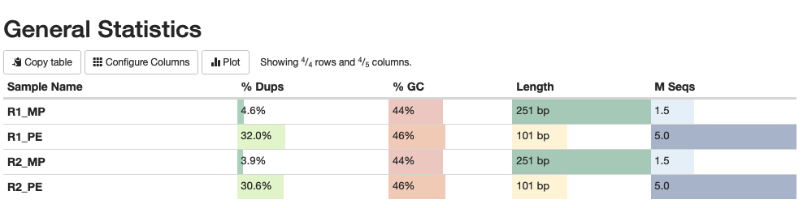
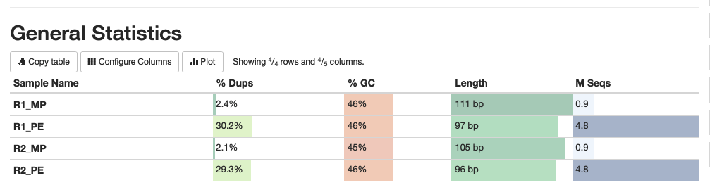
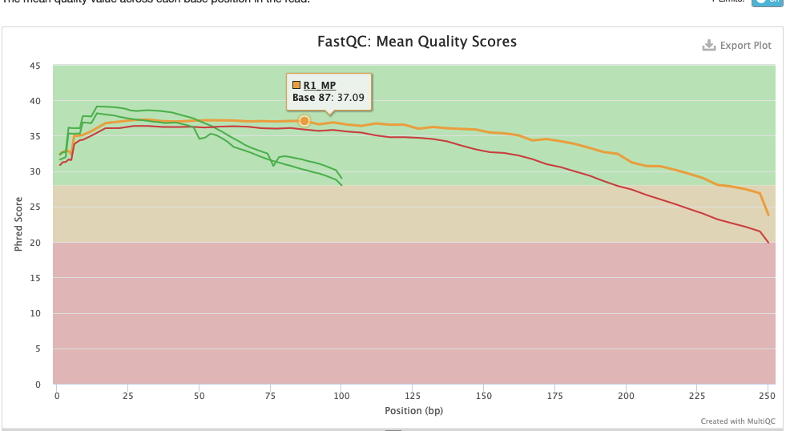
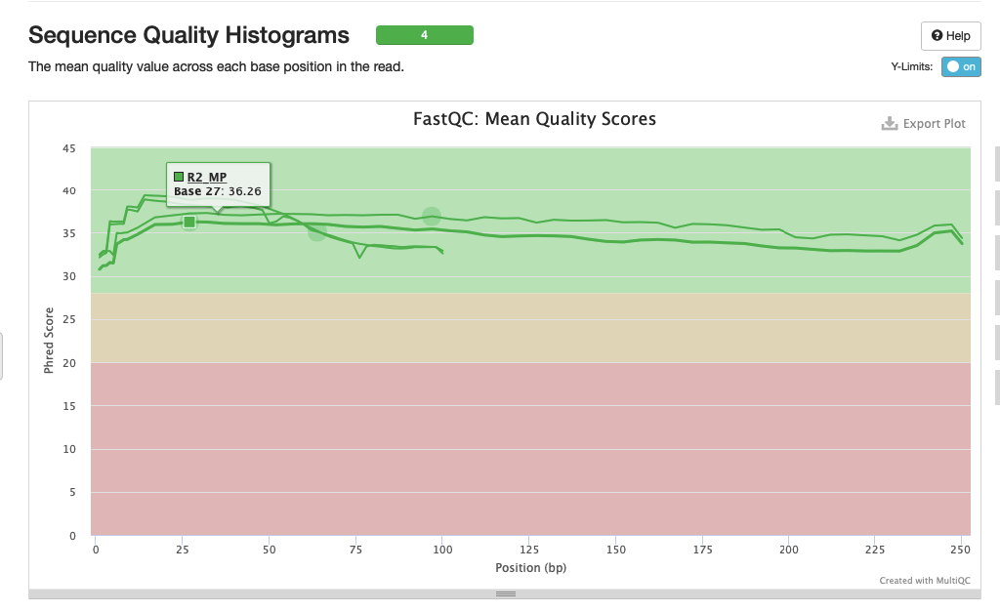
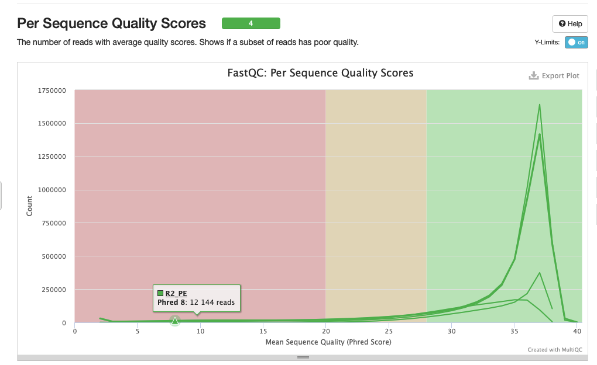

# hse21_hw1
## Список выполненных команд в Терминале (не приведены вспомогательные команды типа cd, mv или rm):  
Создадим папку для работы и внесём туда ссылки:

    mkdir Data  
    cd Data  
    ln -s /usr/share/data-minor-bioinf/assembly/oil_R1.fastq  
    ln -s /usr/share/data-minor-bioinf/assembly/oil_R2.fastq  
    ln -s /usr/share/data-minor-bioinf/assembly/oilMP_S4_L001_R1_001.fastq  
    ln -s /usr/share/data-minor-bioinf/assembly/oilMP_S4_L001_R2_001.fastq  

Отберём случайные чтения:

    mkdir Selected  
    seqtk sample -s131 oil_R1.fastq 5000000 > ~/Data/Selected/R1_PE.fastq  
    seqtk sample -s131 oil_R2.fastq 5000000 > ~/Data/Selected/R2_PE.fastq  
    seqtk sample -s131 oilMP_S4_L001_R1_001.fastq 1500000 > ~/Data/Selected/R1_MP.fastq  
    seqtk sample -s131 oilMP_S4_L001_R2_001.fastq 1500000 > ~/Data/Selected/R2_MP.fastq  

Проверим их качество:

    mkdir fastqc      
    ls *.fastq | xargs -P 4 -tI{} fastqc -o fastqc {}      
    mkdir multiqc      
    multiqc -o multiqc fastqc    

Подрежем полученные чтения и снова проверим качество:

    platanus_internal_trim R1_MP.fastq R2_MP.fastq  
    platanus_trim R1_PE.fastq R2_PE.fastq  
    mkdir Trim  
    ls *.trimmed | xargs -tI{} fastqc -o Trim {}  
    mkdir multiqc2  
    multiqc -o multiqc2 Trim  
    
Наконец, соберём контиги, скаффолды и подчищенные скаффолды:

    mkdir Final  
    platanus_assemble -f R1_PE.fastq.trimmed R2_PE.fastq.trimmed 2> ~/Data/Selected/Final/assemble.log  
    platanus scaffold -c out_contig.fa -IP1 R1_PE.fastq.trimmed R2_PE.fastq.trimmed -OP2 R1_MP.fastq.int_trimmed R1_MP.fastq.int_trimmed 2> ~/Data/Selected/Final/scaffold.log  
    platanus gap_close -c out_scaffold.fa -IP1 R1_PE.fastq.trimmed R2_PE.fastq.trimmed -OP2 R1_MP.fastq.int_trimmed R1_MP.fastq.int_trimmed 2> ~/Data/Selected/Final/gapclose.log  
    
Проверка качества чтений (до и после подрезания соответственно):  
До  

После

До  

После  

До  

После  

